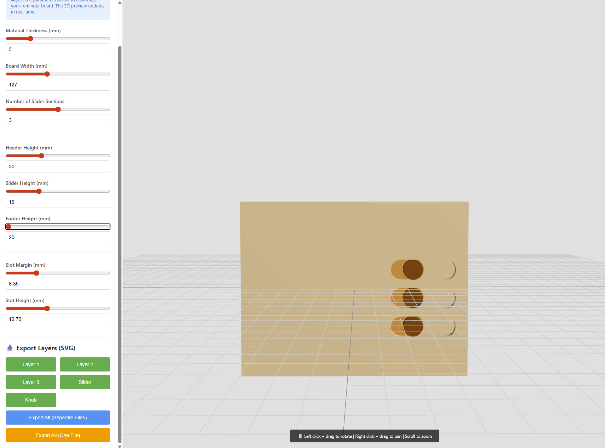
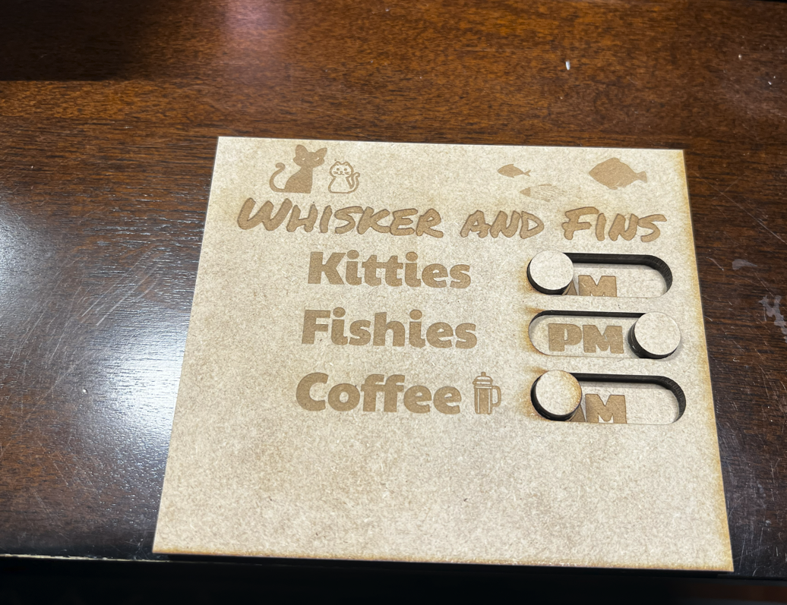

# Laser Reminder Slider Generator

A parametric laser-cut reminder board designer with interactive 3D preview and SVG export. Create custom sliding message boards for tracking daily tasks, pet care, baby schedules, and more.





## Features

- Interactive 3D Preview - See your design in real-time as you adjust parameters
- Fully Parametric - Customize every dimension with easy-to-use sliders
- Multiple Export Options - Export individual layers or all layers in one optimized SVG
- Web-Based - No installation required, runs entirely in your browser
- OpenSCAD Integration - Includes .scad file for advanced users
- Python Automation - Batch export script for OpenSCAD workflow
- Precision Design - All dimensions in millimeters with configurable tolerances

## Quick Start

### Web Designer (Recommended)

1. Download `reminder_board_designer.html`
2. Open it in any modern web browser
3. Adjust parameters using the sliders
4. Click "Export All (One File)" to download your laser-ready SVG

That's it. No installation, no dependencies.

### OpenSCAD Workflow

1. Download `reminder_board.scad`
2. Open in OpenSCAD
3. Modify variables at the top of the file
4. Use Python script `export_layers.py` to batch export all layers

## What You Get

The design generates 5 laser-cut pieces per slider section:

1. **Layer 1** - Bottom/back panel (solid)
2. **Layer 2** - Middle layer with full-length slider tracks
3. **Layer 3** - Top layer with knob cutouts for slider control
4. **Slider** - Sliding piece that moves within the tracks
5. **Knob** - Control knob (glues to slider, protrudes through Layer 3)

Stack order: Layer 1 → Slider → Layer 2 → Layer 3 with Knob

## Use Cases

Perfect for creating reminder boards for:
- Baby care (Fed/Hungry, Clean/Dirty, AM/PM naps)
- Pet care (Fed/Not Fed, In/Out, Walked/Not Walked)
- Medication tracking (Taken/Not Taken)
- Household tasks (Done/To Do)
- Daily routines (Morning/Evening tasks)
- Any binary or multiple-choice reminders

## Customizable Parameters

### Basic Dimensions
- **Material Thickness** - Thickness of your laser-cut material (default: 3mm)
- **Board Width** - Overall width of the board (default: 127mm)
- **Number of Slider Sections** - How many sliders to include (1-5)

### Section Heights
- **Header Height** - Top section for labels/text (default: 30mm)
- **Slider Height** - Height of each slider track (default: 16mm)
- **Footer Height** - Bottom section for labels/text (default: 30mm)

### Advanced Settings
- **Slot Margin** - Distance from edges to slider track (default: 6.35mm)
- **Slot Height** - Height of the slider track (default: 12.70mm)
- Layer gaps, clearances, and knob dimensions (in the code)

## Design Details

- **Layer Gap**: 0.05mm between layers for smooth sliding
- **Slider Clearance**: 0.2mm to prevent binding
- **Knob Clearance**: 0.3mm for easy finger access
- **Pill-Shaped Tracks**: Rounded ends prevent sharp corners

## Materials & Assembly

### Recommended Materials
- 3mm plywood, MDF, or acrylic
- Wood glue or CA glue for assembly

### Assembly Instructions
1. Cut all pieces on your laser cutter
2. Test-fit slider in Layer 2 tracks (should slide smoothly)
3. Glue knob to right end of slider (centered)
4. Stack layers: Layer 1 (bottom) → Layer 2 → Layer 3 (top)
5. Glue layers together, ensuring slider moves freely
6. Add labels to header/footer sections

### Tips
- Test cut one slider section before cutting the full design
- Adjust clearance parameters if slider is too tight/loose
- Consider adding magnets to bottom for mounting on refrigerator

## File Structure

```
laser-reminder-slider-generator/
├── reminder_board_designer.html    # Web-based designer (recommended)
├── reminder_board.scad              # OpenSCAD parametric model
├── export_layers.py                 # Python batch export script
├── README.md                        # This file
├── LICENSE                          # MIT License
└── images/                          # Example images and screenshots
    ├── example_board.png
    ├── web_interface.png
    └── assembly_diagram.png
```

## Browser Compatibility

The web designer works in all modern browsers:
- Chrome/Edge (recommended)
- Firefox
- Safari
- Opera

Requires JavaScript enabled and WebGL support.

## Python Export Script Usage

For OpenSCAD users who want to automate exports:

```bash
python export_layers.py
```

**Requirements:**
- Python 3.x
- OpenSCAD installed and in PATH (or update `OPENSCAD_EXECUTABLE` in script)

The script will generate all 5 layers as SVG files in the `laser_cuts/` folder.

## OpenSCAD Tips

Edit the variables at the top of `reminder_board.scad`:

```openscad
// KEY VARIABLES
material_thickness = 3;
board_width = 127;
num_slider_sections = 1;
// ... etc
```

Set `export_mode` to preview individual layers:
- `"assembly"` - Full 3D preview
- `"layer1"`, `"layer2"`, `"layer3"` - Individual layers
- `"slider"`, `"knob"` - Slider components

## Contributing

Contributions are welcome. Feel free to:
- Report bugs or request features via Issues
- Submit pull requests for improvements
- Share your designs and modifications
- Improve documentation

## License

This project is licensed under the MIT License - see the [LICENSE](LICENSE) file for details.

## Acknowledgments

- Built with Three.js for 3D visualization
- Inspired by the need for simple, customizable reminder boards
- Thanks to the laser cutting and maker communities

## Gallery

Share your creations by opening an issue or discussion with photos of your finished boards.

---

Questions? Open an issue or start a discussion.

